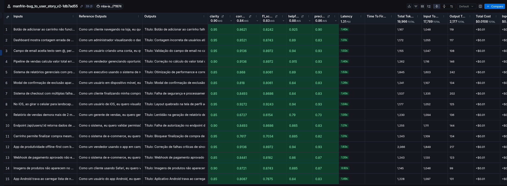

### Técnicas Aplicadas (Fase 2)

few-shot
chain-of-thought
role-prompting

Fui pegando os resultados do eval e melhorando o prompt

### Resultados Finais

https://smith.langchain.com/public/ef18ca49-d2f1-46a5-b371-ad3f1fbba3ff/d

### Principais mudanças da V1 para V2

| Mudança                                             | Por que foi feita                                                   |
| --------------------------------------------------- | ------------------------------------------------------------------- |
| Remoção da análise da resposta final                | Aumentar clareza e precisão, eliminando informações desnecessárias. |
| Definição de formato rígido                         | Melhorar consistência, precisão e F1-Score.                         |
| Padronização dos rótulos                            | Reduzir variações e facilitar a identificação dos campos.           |
| Tratamento de múltiplos problemas sem seções extras | Melhorar clareza e consistência da saída.                           |
| Tratamento de sugestões e feedbacks                 | Evitar respostas inadequadas e aumentar a relevância.               |
| Inclusão de exemplos de saída esperada              | Orientar o modelo para respostas mais corretas e úteis.             |
| Priorização com opção "A definir"                   | Evitar classificações sem informações suficientes.                  |

A V2 tornou o prompt mais estruturado e restritivo, reduzindo ambiguidades, padronizando as respostas e melhorando a precisão, clareza, relevância e consistência das User Stories geradas.

### Como Executar

1. Coloca os env
2. Inicia o python
3. Executa o script de pull to prompt
4. Faz a otimizacao do prompt
5. Executa o script de push do prompt
6. Executa o script de eval pra ver os resultados